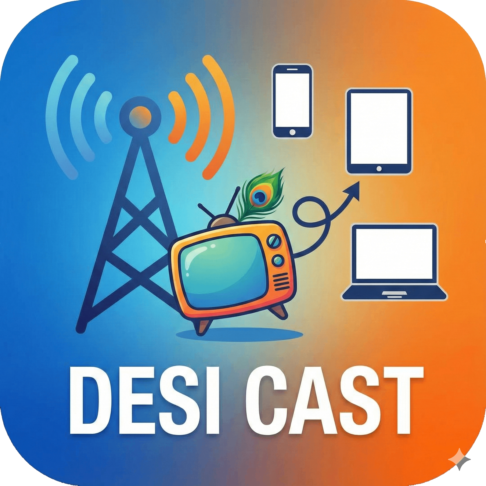

  
  
  # DesiCast
  
  **The Ultimate High-Performance IPTV Player**
  
  
  
  

  

    Experience buffer-free, hardware-accelerated streaming optimized specifically for Indian IPTV channels.  
    Built with <strong>Flutter</strong> & <strong>MPV</strong> for raw power.
  

  
  [**Download Now**](https://github.com/Ghostkwebb/DesiCast/releases/latest) • [**Report Bug**](https://github.com/Ghostkwebb/DesiCast/issues)

---

## 🚀 Why DesiCast?

Most IPTV players stutter, freeze, or crash on unreliable streams. **DesiCast** is engineered to survive them.

### 🔥 Core Features

- **🛡️ Bulletproof Streaming**:
  - **Smart Buffering**: Intelligent 5s buffer pool ensures playback continuity without constant pausing.
  - **Instant Reconnect**: Zero-delay reconnect logic aggressively recovers from network drops.
  - **Error Concealment**: Ignores corrupted frames (missing SPS/PPS/Headers) that would crash other players (`VLC`/`ExoPlayer`).

- **⚡ Performance First**:
  - **Hardware Acceleration**: Full GPU decoding (Metal on macOS, D3D11 on Windows, MediaCodec on Android) for buttery smooth 1080p @ 60fps.
  - **Zero Latency "Catch-Up"**: Automatically detects lag and speeds up playback (1.1x - 1.5x) to catch up to the live edge seamlessly.

- **🎨 Premium Experience**:
  - **Netflix-Inspired UI**: Dark mode glassmorphism interface.
  - **Channel Logos**: Auto-fetched high-res logos for all Indian channels.
  - **Category Filtering**: News, Entertainment, Movies, Music, Sports.
  - **Quality Toggles**: Switch between **"Nuclear Smoothness"** (Software Healing) and **"Visual Fidelity"** (Hardware Decode) instantly.

---

## 📥 Downloads

| Platform | Status | Download |
|:---:|:---:|:---:|
| **macOS**  | ✅ Stable | [**DesiCast_macOS.zip**](https://github.com/Ghostkwebb/DesiCast/releases/latest) |
| **Android** 🤖 | ✅ Stable | [**DesiCast_Android.apk**](https://github.com/Ghostkwebb/DesiCast/releases/latest) |
| **Windows** 🪟 | ✅ Stable | [**DesiCast_Windows.zip**](https://github.com/Ghostkwebb/DesiCast/releases/latest) |

---

## 🛠️ Tech Stack

Built with ❤️ using:
- [**Flutter**](https://flutter.dev) - UI Toolkit
- [**media_kit**](https://github.com/media-kit/media-kit) - FFI bindings for libmpv
- [**libmpv**](https://mpv.io) - The world's most powerful video engine
- [**flutter_bloc**](https://bloclibrary.dev) - State Management

## 📸 Screenshots

*(Add screenshots here)*

---

  Created by <a href="https://github.com/Ghostkwebb">Ghostkwebb</a>

